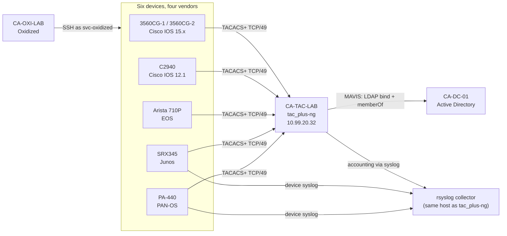

# Centralized Device AAA — TACACS+ Across Four Vendors, Backed by Active Directory

> Part of [CASEY-LAB](https://github.com/117caseyallen-NetAdm/casey-lab), a
> dual-site multi-vendor homelab. The hub has the topology and the
> [verification output](https://github.com/117caseyallen-NetAdm/casey-lab/blob/main/docs/verification.md).

Six network devices across **Cisco IOS (15.x and a 2003-era 12.1), Arista EOS,
Juniper Junos and Palo Alto PAN-OS** authenticate administrators against Active
Directory through one [`tac_plus-ng`](https://github.com/MarcJHuber/event-driven-servers)
server, authorize them by AD group membership, and record what they did —
every command on five of the six devices, configuration changes and logins on
the sixth.

Before this, one local admin password was shared by every person and by the
backup system, and it sat in plaintext in the backup tool's config. Now people
log in as themselves, automation logs in as a scoped read-only service account,
and the local account exists only as break-glass.

One service account, one read-only profile, four vendors — each asking the
server for a different service:

```text
10.99.20.1   svc-oxidized  readonly  permit  shell
10.99.20.1   svc-oxidized  readonly  permit  shell show running-config <cr>
10.99.10.14  svc-oxidized  readonly  deny    shell enable <cr>
10.99.10.14  svc-oxidized  readonly  permit  shell show running-config <cr>
10.99.0.2    svc-oxidized  readonly  permit  junos-exec
10.99.20.2   svc-oxidized  readonly  permit  PaloAlto  protocol=firewall
```

The `deny` is correct and harmless: the profile already grants privilege 15, so
Oxidized's reflexive `enable` is refused and the backup proceeds.



## Same protocol, four different models

| Device | Platform | Service requested | Privilege attribute | Read-only enforced by | Per-command record on the server |
| --- | --- | --- | --- | --- | --- |
| 3560CG-1, 3560CG-2 | Cisco IOS 15.x | `shell` | `priv-lvl` | the server, per command | ✅ |
| C2940 | Cisco IOS 12.1(22)EA13 | `shell` | `priv-lvl` | the server, per command | ✅ |
| Arista 710P | EOS | `shell` | `priv-lvl` | the server, per command | ✅ |
| SRX345 | Junos 20.2R3 | `junos-exec` | `local-user-name` → local login class | the class's permission bits | ✅ via accounting |
| PA-440 | PAN-OS 10.2.7 | `PaloAlto` + `protocol=firewall` | `PaloAlto-Admin-Role` → local admin role | the role **removes commands from the parser** | ❌ config changes and logins only, via syslog |

The profile never changes per vendor — only a branch inside it, keyed on the
service the device asked for.

## What didn't go to plan

The findings worth reading are the ones that broke something. Full write-ups
with evidence in **[docs/findings.md](docs/findings.md)**.

- **"`local` catches the outage" is Cisco behaviour, not a TACACS+ rule.** With
  `group TAC-GROUP local`, IOS and EOS fall back to the local account only when
  the server is *unreachable* — a server that answers "no" is final. Junos fell
  through on a rejection until `password` was removed from
  `authentication-order`. PAN-OS never consults the server for a local admin at
  all. Four vendors, three behaviours, and the rule had been written down as
  protocol truth.
- **Optional attributes can't be trusted in either direction.** An unscoped
  Junos attribute, sent as optional, made IOS throw away the *whole* reply —
  `priv-lvl` included — and the session silently dropped from privilege 15 to 1.
  PAN-OS, sent its admin role as optional, ignored it and refused the login as
  "Invalid user". RFC 8907 lets a device ignore optional attributes it doesn't
  understand; this IOS reads that as "ignore all of them". The fix for both:
  scope every attribute to the service that asked, then send the one each
  device needs as mandatory.
- **CHAP can't work against an LDAP-bind backend.** The server never holds the
  password, so it can't compute the challenge response. PAP works — but it needs
  its own `pap backend` line, and local users need a separate `password pap`
  credential. The test harness passed 10/10 throughout, because it only ever
  tested ASCII login.
- **Five things were configured correctly and didn't work**, each found only by
  checking output rather than config: the SRX backup "succeeded" with 33 lines
  of empty hierarchy (the stock read-only class can't view configuration); the
  PA-440 backup had been timing out (30-second timeout, 39–50-second job); its
  backups carried the chassis serial; SRX accounting had never produced a single
  record (no `source-address`, so it left via the IPsec tunnel and was refused);
  and the old shared password was still in the backup tool's config after every
  device had moved off it.
- **On IOS, the read-only account can read the shared secret.** Read-only has to
  permit `show running-config` — that's how backups work — and on the one switch
  storing its key unencrypted, that showed the key. No privilege model that
  allows the command can protect what's in its output. Per-device keys are what
  limit the damage.

## What's here

- **[configs/tac_plus-ng.cfg.example](configs/tac_plus-ng.cfg.example)** — the
  server config, sanitized, with the non-obvious lines commented
- **[configs/device-aaa/](configs/device-aaa/)** — the AAA configuration on each
  platform: IOS 15.x, IOS 12.1, EOS, Junos, PAN-OS
- **[configs/rsyslog/](configs/rsyslog/)** and
  **[configs/oxidized-model-overrides/](configs/oxidized-model-overrides/)** —
  the log collector rules and two Oxidized redaction fixes
- **[scripts/tac-validate.sh](scripts/tac-validate.sh)** — validates the
  ruleset against the running server with no network device involved; 13 checks
  across ASCII and PAP
- **[docs/build-notes.md](docs/build-notes.md)** — each phase, ending in the
  check that proved it
- **[docs/verification.md](docs/verification.md)** — the log evidence and the
  fail-safe test matrix

## Limits, stated plainly

- **TACACS+ does not encrypt.** The body obfuscation is an MD5-based stream from
  1993; RFC 8907 says outright that it is not secure and that TACACS+ must run on
  a secured network. The server and every device's management interface sit on
  the management VLAN, behind per-device permit lists.
- **The directory lookup is LDAP on 389, not LDAPS.** Fixing that needs an
  internal certificate authority, which is a separate project.
- **The log collector runs on the AAA server.** Anyone who compromised the AAA
  server could edit the record of what they did with it. Acceptable in a lab; a
  separate SIEM is the fix.
- **The PA-440's local admin is always reachable over SSH**, whatever state the
  server is in — PAN-OS authenticates local accounts locally by design. That
  makes it the most exposed break-glass credential in the fleet.
- **Log sanitizing is a denylist.** `rewrite` catches `key`/`secret`/`password`
  followed by a value; it would not catch `ntp authentication-key 1 md5 <value>`.
  Every log excerpt published here was read by a human first.
